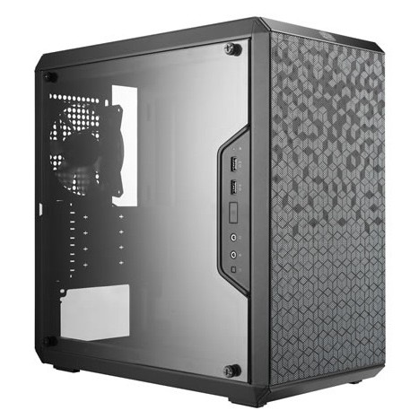
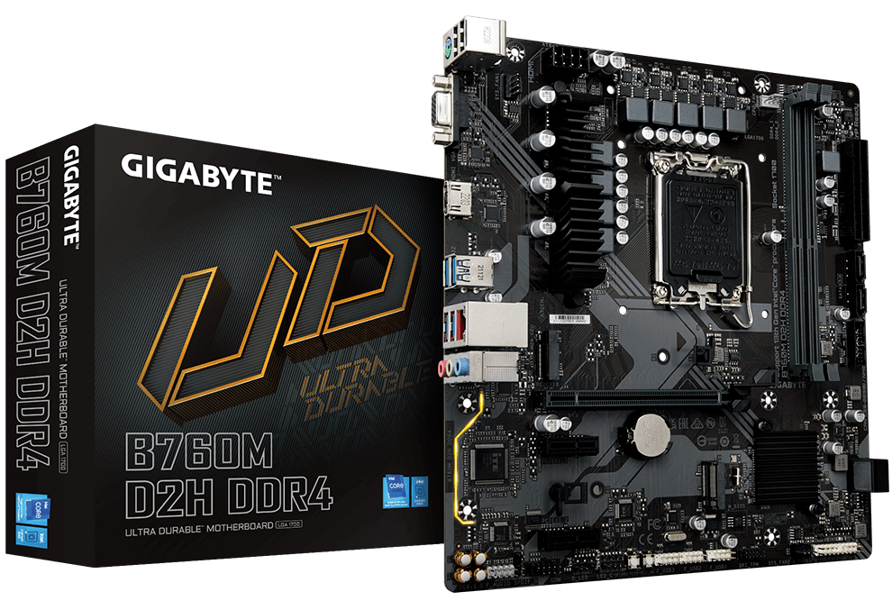
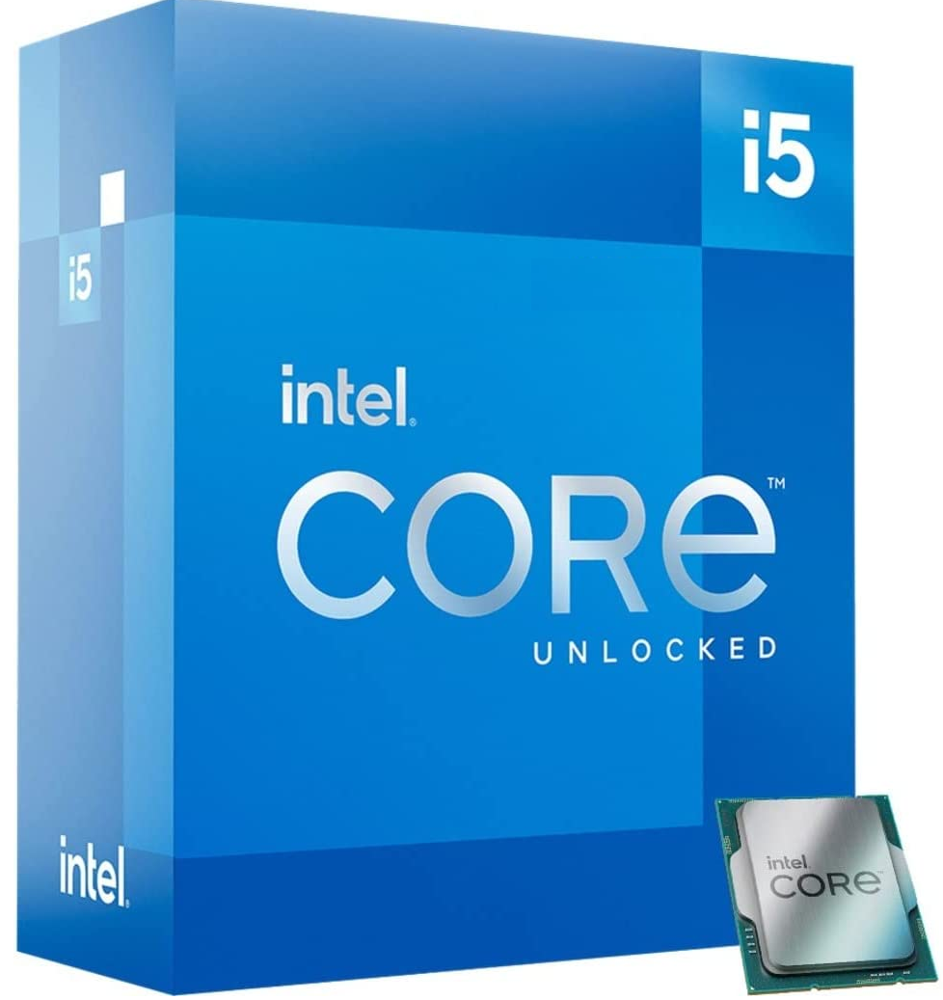
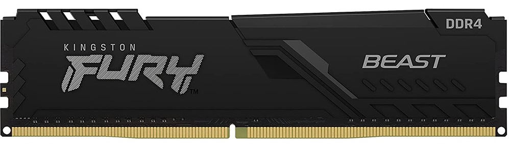
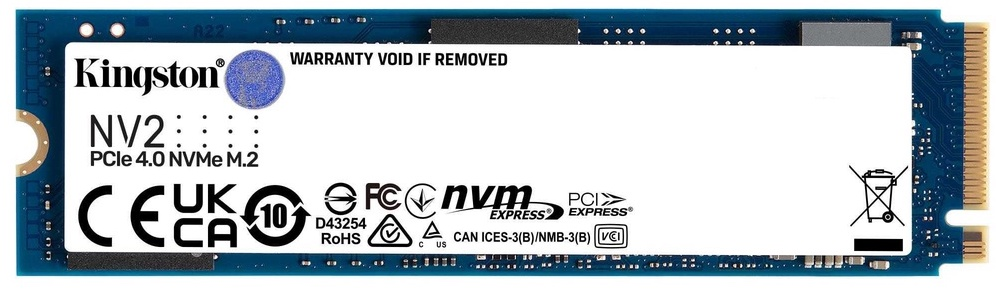
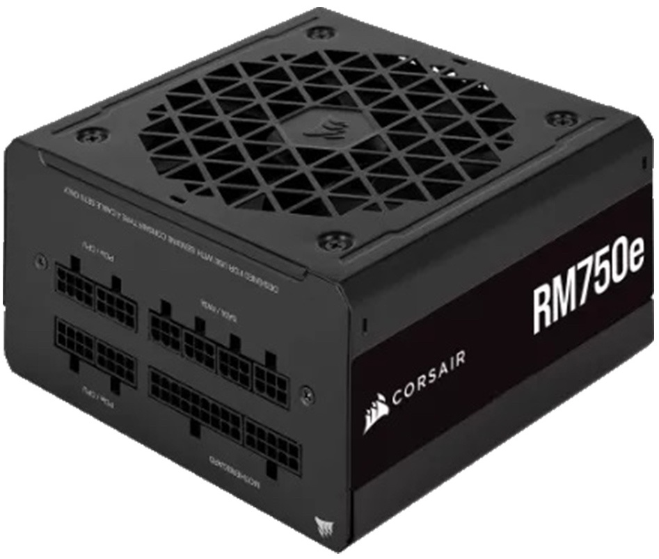
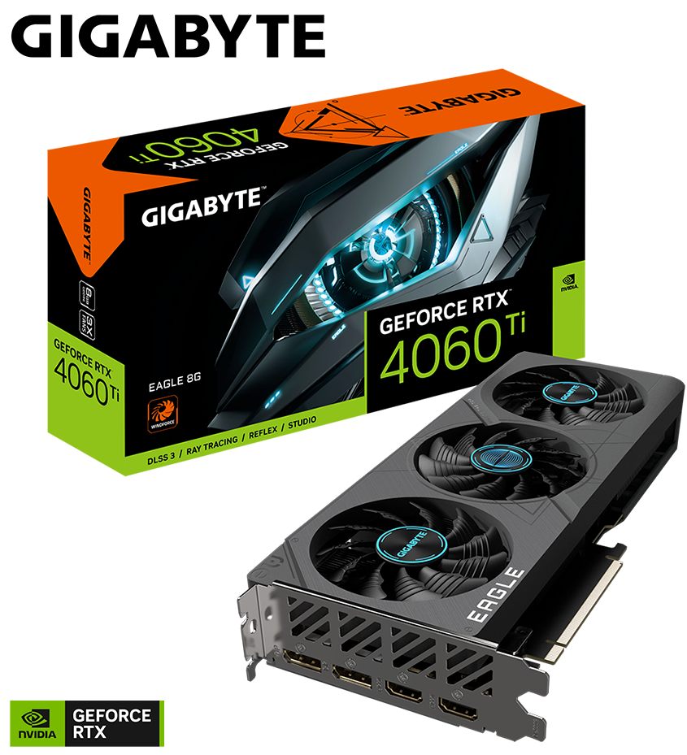

---
hide:
 - footer
---

This article is the first part of the PC DIY series, buying hardware. We have three parts in this series, and the hardware mentioned is based on the mid-end gaming rig I built.

The essential components of a PC consist of the following: 
 (1) **Case**: Protect the components and have a switch to turn on your computer.
 (2) **Mainboard**: As the backbone of the computer.
 (3) **Processor / CPU**: As the brain of the computer.
 (4) **Memory / RAM**: To store information that needs to be used quickly.
 (5) **Storage**: To host the operating system (most likely Windows) and store your files.
 (6) **Power Supply / PSU**: To power up the computer.
 (7) **Graphic card / GPU** (optional): 

The first thing is to choose a casing size. The common sizes are itx, matx, atx. You can think of itx as the small size, matx as the medium size, atx as the large size. We will be using matx as the example. Now we have chosen the casing size, let's look at the mainboard. I recommend using this search term for a better deal "intel mainboard combo". 

Three info in the mainboard are important: the size, supported processor, and supported ram. Take "GIGABYTE B760M D2H DDR4 LGA1700" as the example: DDR4 is the RAM type, and LGA 1700 is the processor socket, which we can use to find a compatible processor. 

We chose the CPU "Intel i5 13400", which supports DDR4 and DDR5 RAM. The RAM we chose is "Kingston Fury Beast 16GB 3200", which has 16GB of memory and 3200mhz (the higher number higher the speed). For the storage, unless you need HDD to store files, I would suggest just opt for SSD as the speed is faster. We choose "Kingston NV1 NVMe M.2 SSD 1TB", which looks like a small thin stick rather than a conventional hard disc.

The choice of power supply depends on the graphic card you will be using. I suggest going for the one with a higher power for safety reasons. We are using "GIGABYTE GeForce RTX4060 TI", so the power supply we chose, "Corsair RM 750e Gold" is slightly more than enough.

Here I'm listing a summary of the build mentioned:

 (1) Case: Cooler Master MasterBox Q300L
   
 (2) Mainboard: GIGABYTE B760M D2H DDR4 LGA1700
 
 (3) Processor / CPU: Intel i5 13400 LGA1700
 
 (4) Memory / RAM: Kingston Fury Beast 16GB 3200
 
 (5) Storage: Kingston NV1 NVMe M.2 SSD 1TB
 
 (6) Power Supply / PSU: Corsair RM 750e Gold
 
 (7) Graphic card / GPU (optional): GIGABYTE GeForce RTX4060 TI EAGLE 8GB
 

Next, we will look at [installing the hardware](pc-diy-installing-hardware).