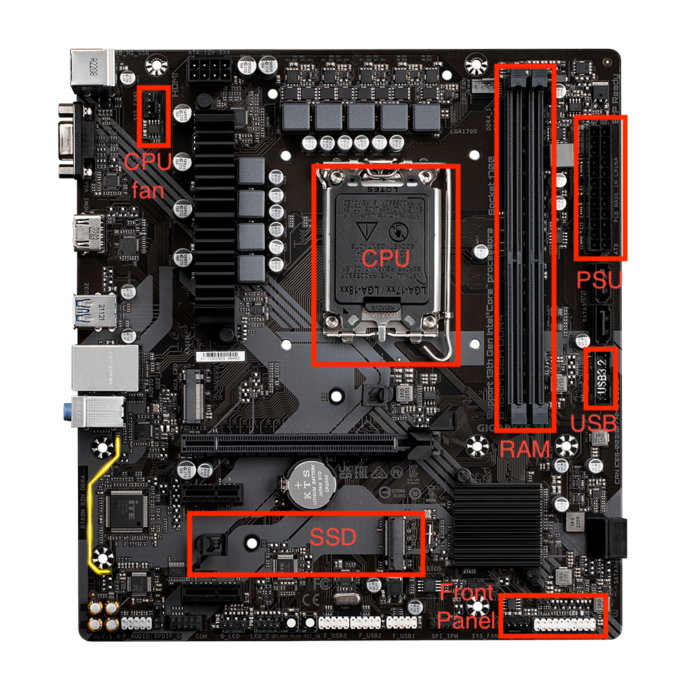
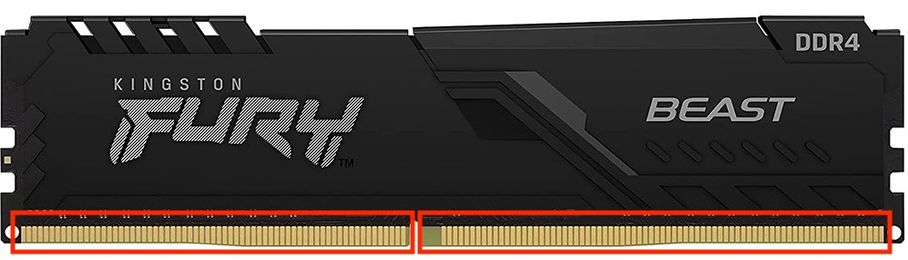
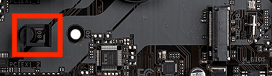
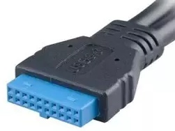
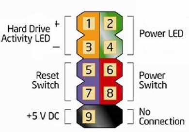

---
hide:
 - footer
---

# PC DIY 2 - Installing Hardware

The installation guide is based on the hardware we mentioned in [PC DIY 1](pc-diy-buying-hardware.md). Let's first look at the mainboard. I have annotated the parts we're going to cover with red rectangles.

Take out the plastic cover at the CPU slot. Then, take out the CPU from the CPU package. Put the CPU into the slot following the arrow direction at the bottom.  

  

After the CPU cover on the board is closed, put the "CPU fan" on the CPU. Ensure you hear the click sounds from the four sides of the fan. Plug the cable attached to "CPU fan" to the "CPU fan slot" in the mainboard. Next, plug RAM into the slot at the right of the CPU slot. The left and right side of the ram is different, so just slot them according to the slot length. In my case, the side with the logo is facing right.  

Now, let's look at the SSD slot. Open the rubber clip by pinching the square hollow part, not the whole thing. Insert SSD into the mainboard, and the other end should rest flat at the rubber clip hole. Put the clip back to make sure the SSD doesn't move. 

Now, screw the mainboard to the casing. After that, we will connect the cable attached to the case. There are two sets of cables. First, plug the USB cable into the mainboard — the cable looks like this.

Then, we plug the "Front Panel cable" according to the image below.

The last step is to connect the PSU to the mainboard. Screw the PSU to the casing, then connect the cable to the "Motherboard" and "CPU" slot in PSU. Plug the respective cable into the mainboard, and you're ready for the [setup stage](pc-diy-setup-machine.md).