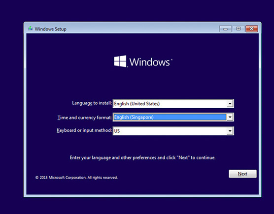
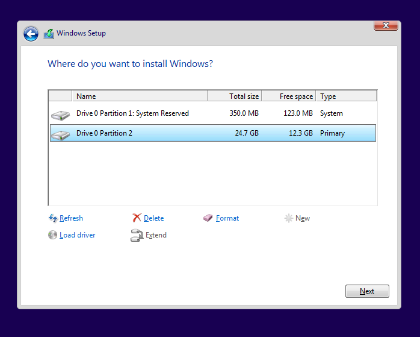

---
hide:
 - footer
---
# PC DIY 3 - Setup Machine

This article is the last part of the PC DIY series, set up the machine. You can read the previous two here: [PC DIY 1 - Buying Hardware](blog/pc-diy-buying-hardware.md) & [PC DIY 2 - Installing Hardware](blog/pc-diy-installing-hardware.md).

We will be installing Windows OS on our machine. First, ensure you have a bootable USB drive, which you need to create on the existing OS. I recommend using Rufus to create your bootable drive:
Download Windows ISO.
Plug the pendrive to your PC (not the newly built one).
Run Rufus to complete the creation process.
Now, plug the bootable pendrive into the newly built machine.

Here's what to do if the machine is started but you see the BIOS screen instead of the Windows installation screen. You need to disable "Secure Boot" and enable "CSM support" and "Legacy Boot." Save and Exit the BIOS. You should see the Windows installation screen now. 

Click next to the Disc Partition Creation page. Click "New" and proceed. You will see a few partitions being created. Click next and follow the instructions. 

You will have your OS installed.